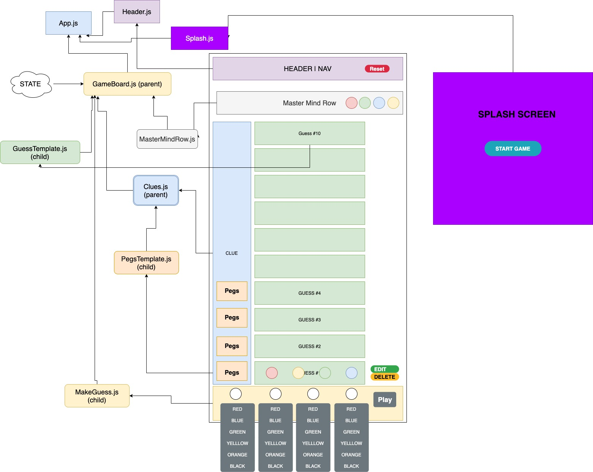

# Master Mind Clone 
### A simple react based Master Mind game.
### _By Todd Walraven, Dominique Youmans, Alex Skreen, Dusty McCord. Last updated April 21, 2020_

## Description
This is a simple web game that mimics the game play of the classic board game Master Mind. 

### [Link to working demo](https://gallant-dijkstra-379443.netlify.app/)

## Specs

* App starts by showing splash screen with a start game button.
  * User can click on button to start the game. 

* On start game app hides splash screen and shows game board.
    * User can select colors for their guess and hit the play button.

* Program will check if last guess has matching colors to current master color sequence. If any colors match the user will recieve black or white pegs in return.
    * Black for right color, right space.
    * White for right color, wrong space.

* When user picks correct color sequence.
    * Program will show a win message.
    
* If user guesses 10 times but does not guess the right color sequence.
    * Program will show a losing message. 

  
## Component diagram 




## Installation instructions

Clone the project by typing this command into your terminal.
```sh
git clone https://github.com/dustatron/React-Social-Media.git
```

In the project directory, you can run: 

 ```sh
 yarn start
```
Runs the app in the development mode.<br />
Open [http://localhost:3000](http://localhost:3000) to view it in the browser.

The page will reload if you make edits.<br />
You will also see any lint errors in the console.

 ```sh
 yarn test
```
Launches the test runner in the interactive watch mode.<br />
See the section about [running tests](https://facebook.github.io/create-react-app/docs/running-tests) for more information.

 ```sh
  yarn build
 ```

Builds the app for production to the `build` folder.<br />
It correctly bundles React in production mode and optimizes the build for the best performance.

The build is minified and the filenames include the hashes.<br />
Your app is ready to be deployed!

See the section about [deployment](https://facebook.github.io/create-react-app/docs/deployment) for more information.

 ```sh
  yarn eject
 ```
**Note: this is a one-way operation. Once you `eject`, you can’t go back!**

If you aren’t satisfied with the build tool and configuration choices, you can `eject` at any time. This command will remove the single build dependency from your project.

Instead, it will copy all the configuration files and the transitive dependencies (webpack, Babel, ESLint, etc) right into your project so you have full control over them. All of the commands except `eject` will still work, but they will point to the copied scripts so you can tweak them. At this point you’re on your own.

You don’t have to ever use `eject`. The curated feature set is suitable for small and middle deployments, and you shouldn’t feel obligated to use this feature. However we understand that this tool wouldn’t be useful if you couldn’t customize it when you are ready for it.
